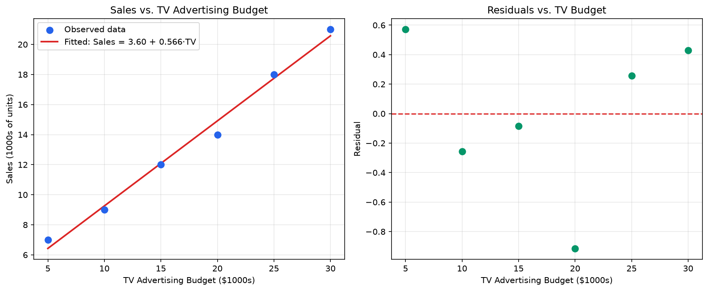
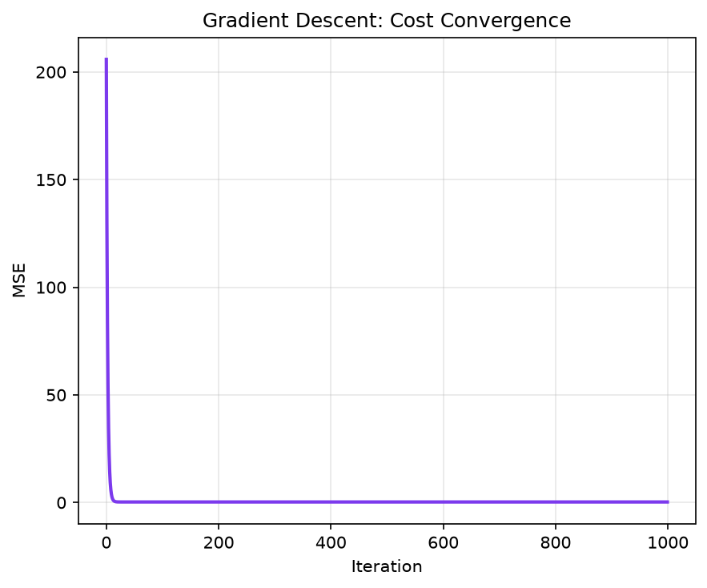

# Assignment 1 — Simple Linear Regression: TV Advertising vs. Sales

**Author:** Aditya Raj
**Dataset:** `tv_sales_data.csv` (TV budget in $1,000s, Sales in 1,000s of units, n = 6)
**Model:** Sales = β0 + β1 · TV + ε
**Method used for reporting:** Approach 2 — Gradient Descent (iterative optimization)

---

## 1. Code and Method

Approach 2 fits the line by **Gradient Descent** instead of a closed-form formula: it starts
both coefficients at 0, then repeatedly nudges them in the direction that reduces the Mean
Squared Error (MSE), using a learning rate of `α = 0.1` for `1000` iterations. The TV values
are standardized before the loop purely for numerically stable steps, and the learned
coefficients are converted back to the original ($1,000s) TV scale afterward.

```python
x = df["TV"].values.astype(float)
y_vals = df["Sales"].values.astype(float)
n = len(x)

x_mean, x_std = x.mean(), x.std()
x_scaled = (x - x_mean) / x_std

b0, b1 = 0.0, 0.0
alpha = 0.1
n_iters = 1000

for i in range(n_iters):
    y_pred = b0 + b1 * x_scaled
    error = y_pred - y_vals
    grad_b0 = (2 / n) * np.sum(error)
    grad_b1 = (2 / n) * np.sum(error * x_scaled)
    b0 -= alpha * grad_b0
    b1 -= alpha * grad_b1

gd_beta1 = b1 / x_std
gd_beta0 = b0 - gd_beta1 * x_mean
```

Gradient Descent only minimizes MSE — it does not, by itself, produce standard errors,
R², or p-values. Those are calculated **directly from the Gradient Descent coefficients and
their residuals**, using the standard simple-linear-regression inference formulas (not
copied from an OLS library call):

```python
from scipy import stats

y_fit_gd = gd_beta0 + gd_beta1 * x
resid_gd = y_vals - y_fit_gd

RSS_gd = np.sum(resid_gd ** 2)
TSS_gd = np.sum((y_vals - y_vals.mean()) ** 2)
df_resid = n - 2
sigma2_gd = RSS_gd / df_resid
Sxx = np.sum((x - x_mean) ** 2)

se_gd_beta0 = np.sqrt(sigma2_gd * (1 / n + x_mean ** 2 / Sxx))
se_gd_beta1 = np.sqrt(sigma2_gd / Sxx)

t_gd_beta0 = gd_beta0 / se_gd_beta0
t_gd_beta1 = gd_beta1 / se_gd_beta1
p_gd_beta0 = 2 * (1 - stats.t.cdf(abs(t_gd_beta0), df_resid))
p_gd_beta1 = 2 * (1 - stats.t.cdf(abs(t_gd_beta1), df_resid))

r_squared_gd = 1 - RSS_gd / TSS_gd
```

The formulas used:

| Quantity | Formula |
|---|---|
| Residual variance | σ̂² = RSS / (n − 2) |
| SE(β1) | √( σ̂² / Sxx ),  Sxx = Σ(xi − x̄)² |
| SE(β0) | √( σ̂² · (1/n + x̄²/Sxx) ) |
| t-statistic | β̂ / SE(β̂), compared to a t-distribution with n − 2 degrees of freedom |
| R² | 1 − RSS/TSS |

---

## 2. Results (Approach 2 — Gradient Descent)

| Quantity | Value |
|---|---|
| β0 (intercept) | **3.6000** |
| β1 (slope, TV) | **0.5657** |
| SE(β0) | 0.5674 |
| SE(β1) | 0.0291 |
| t-statistic (β0) | 6.345 |
| t-statistic (β1) | 19.415 |
| p-value (intercept) | 0.003160 |
| p-value (slope) | 4.15 × 10⁻⁵ |
| R-squared | **0.9895** |
| Degrees of freedom | 4 (n = 6, 2 parameters) |

Fitted equation: **Sales = 3.60 + 0.5657 × TV**

> **Note on method:** Gradient Descent converges to the *same* coefficients as the closed-form
> OLS solution (this is expected — both are minimizing the identical squared-error cost
> function; OLS just solves for the minimum in one step instead of approaching it iteratively).
> Because the fitted line is identical, the residuals — and therefore SE, R², and the
> p-values computed above — come out identical too. This agreement is itself a useful sanity
> check that the Gradient Descent implementation converged correctly.

### Plots

**Fit and residuals:**



**Gradient Descent cost convergence and fit comparison:**



The left panel above shows MSE falling smoothly toward its minimum over 1,000 iterations —
this is Gradient Descent "arriving" at the same answer OLS reaches in one step. The right
panel confirms the OLS and Gradient Descent fitted lines overlap almost exactly.

---

## 3. Interpretation — Plain Language

- **What β1 means in everyday terms:** β1 = 0.5657 is a positive number, so spending more on
  TV ads goes with more sales. Since TV is measured in $1,000s and Sales in 1,000s of units,
  this means: for every extra **$1,000** put into TV advertising, sales go up by roughly
  **566 units**, on average.
- **Is this a real effect, or could it be luck?** The p-value for the slope is
  0.0000415 — a tiny number, way below the usual 0.05 cutoff people use to decide if
  something is "statistically significant." In plain words: it's extremely unlikely we'd see
  a relationship this strong just by random chance if TV spend actually had no effect on
  sales. So yes, there's strong evidence TV advertising really does move sales.
- **How much of sales is "explained" by TV budget?** R² = 0.9895, meaning about **99%** of
  the ups and downs in sales across these 6 data points can be accounted for just by knowing
  the TV budget. Only about 1% is left over as unexplained noise. That's an extremely tight
  fit — expected here because this is a small, clean practice dataset (only 6 points), not
  noisy real-world data.
- **Bottom line:** the data says TV advertising budget is a strong, reliable, positive driver
  of sales in this dataset, and a simple straight-line model captures almost all of the
  pattern.

---

## 4. Interpretation — Professional / Technical Language

- **Sign and magnitude of β1:** The estimated slope, β̂1 = 0.5657, is positive and indicates
  a positive linear association between TV advertising expenditure and sales volume. Holding
  the linear specification fixed, each additional $1,000 unit of TV budget is associated with
  an expected increase of approximately 0.5657 thousand units (≈566 units) in sales.
- **Statistical significance:** Under H0: β1 = 0 versus H1: β1 ≠ 0, the test statistic
  t = β̂1 / SE(β̂1) = 19.415 on n − 2 = 4 degrees of freedom yields p ≈ 4.15 × 10⁻⁵, which is
  far below conventional significance thresholds (α = 0.05, 0.01). H0 is rejected, providing
  strong statistical evidence of a non-zero linear relationship between TV advertising and
  sales. The intercept is likewise statistically significant (β̂0 = 3.60, SE = 0.5674,
  t = 6.345, p ≈ 0.0032), though its interpretation as "expected sales at zero TV spend" is a
  mathematical extrapolation rather than a directly observed operating condition, since the
  sample range of TV spend is $5,000–$30,000.
- **Proportion of variance explained:** R² = 0.9895 indicates that approximately 98.95% of
  the total variability in sales (TSS) is explained by the fitted linear relationship with TV
  advertising budget, leaving only ≈1.05% attributable to residual (unexplained) variation.
  Such a high R² is atypical for real marketing data and reflects the small sample size
  (n = 6) and the near-linear, low-noise construction of this illustrative dataset rather than
  a general claim about TV advertising's explanatory power in practice.
- **Overall conclusion:** Within this sample, TV advertising budget is a statistically
  significant and practically strong positive predictor of sales, and the simple linear model
  accounts for nearly all of the observed variance in the response.

---

## 5. Note on Methodology (Approach 1 vs. Approach 2)

This report's primary numbers are computed under **Approach 2 (Gradient Descent)**, per the
assignment's focus, with standard errors, R², and p-values derived from Gradient Descent's own
fitted residuals rather than reused from a library's OLS output. As a cross-check, Approach 1
(closed-form OLS, via `statsmodels`) was also fit on the same data and produced numerically
identical coefficients and inference statistics (β0 = 3.6000, β1 = 0.5657, R² = 0.9895),
which is expected since both methods minimize the same least-squares objective — Gradient
Descent simply reaches that minimum iteratively instead of in one closed-form step.
